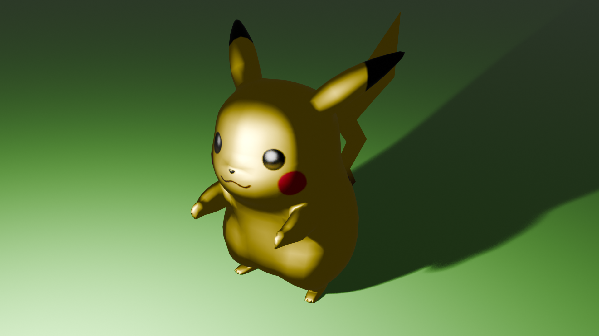

# Pikachu 3D Model Project 🎨

This is a beginner-level 3D modeling project created in Blender. I made a simple 3D model of **Pikachu**, the iconic Pokémon character, while learning the basics of Blender. This project focuses on understanding modeling, materials, lighting, and rendering.

## Project Description 📝

- This project involves creating a basic **Pikachu** model.
- The body is modeled using simple shapes like spheres and cylinders.
- Materials were added to give Pikachu its signature yellow color, red cheeks, and black-tipped ears.
- A simple lighting setup was used to highlight the model and render a clean final image.

## Final Render 📷

Here’s how the model looks after rendering in Blender:



## What I Learned 🌟

1. **Basic 3D Modeling**: Using Blender to create shapes and combine them into a recognizable character.
2. **Material and Shading**: Applying colors and textures to objects.
3. **Lighting Setup**: Adding lights like a sun and point light for better rendering.
4. **Rendering**: Capturing the final image with proper settings.

## How to View This Project 🚀

1. Clone this repository:
   ```bash
   git clone https://github.com/PushkarPisolkar04/your-repo-name.git
